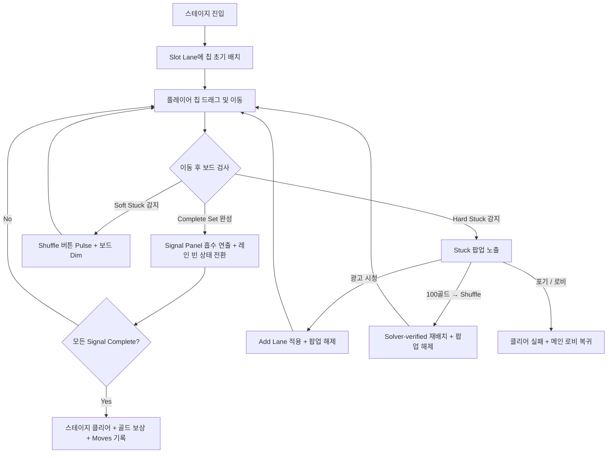

# Signal Sort 시스템 기획서 (Signal Sort System Design)

본 문서는 `project-fill`의 핵심 게임 플레이인 **Signal Sort (시그널 소트)**에 대한 시스템 기획서입니다. 플레이어가 흩어진 컬러 신호 칩을 슬롯 레인에 정렬하여 상단의 시그널 패널을 복구하는 핵심 규칙, 부스터 사양, 교착 상태 구제 로직을 다룹니다.

---

## 1. 개요 및 설계 원칙

- **한 줄 콘셉트**: 흩어진 컬러 신호 칩을 슬롯 레인에 정렬하여 상단의 Signal Panel을 복구하는 미니멀 코드 퍼즐.
- **비주얼 톤앤매너**: 튜브나 물병 같은 전통적인 오브젝트를 배제하고, 세련된 반도체 칩, 카드 슬롯, 회로 기판 등의 전자공학/기판 느낌의 UI 및 1x1 텍스처, 라운드 사각형, 픽셀 텍스트를 위주로 한 코드 기반 미니멀 아트 스타일을 따릅니다.
- **핵심 판타지**: 고장 나거나 꼬인 시스템의 컬러 신호를 정돈해 나가며 상단 패널의 노드와 라인이 하나씩 점등되는 릴랙싱한 기계 복구 감각.

---

## 2. 용어 정의

| 용어 | 정의 |
| :--- | :--- |
| **Signal Chip (칩)** | 유저가 이동시키는 기본 퍼즐 피스. 라운드 사각형 모양이며, 색상과 고유 신호 타입 심볼/패턴이 표기됩니다. |
| **Slot Lane (레인)** | 칩이 수직으로 쌓이는 컨테이너. 물리적인 튜브가 아니라 카드 랙이나 회로 슬롯처럼 표현됩니다. |
| **Capacity (수용량)** | 한 레인이 가질 수 있는 최대 칩 개수. 기본값은 4개입니다. |
| **Top Chip (맨 위 칩)** | 레인의 가장 위에 위치한 칩으로, 현재 조작을 통해 이동할 수 있는 유일한 대상입니다. |
| **Complete Set (세트 완성)** | 한 레인이 동일한 Signal Type의 칩 4개(Capacity)로 완전히 채워진 상태입니다. |
| **Assist (부스터)** | 플레이 중 위기 탈출이나 편의를 돕는 아이템 및 기능. `Add Lane`, `Shuffle`, `Undo` 3종이 존재합니다. |

---

## 3. 기본 규칙 (Gameplay Rules)

- **A-R01 (선택 규칙)**: 유저는 레인의 가장 위에 있는 `Top Chip`만 선택하여 집어 올릴 수 있습니다.
- **A-R02 (이동 규칙)**: 선택한 칩은 **비어 있는 레인** 또는 **맨 위의 칩이 동일한 Signal Type인 레인**으로만 이동할 수 있습니다.
- **A-R03 (수용량 규칙)**: 각 레인의 `Capacity`는 기본 4이며, 이를 초과하여 칩을 배치할 수 없습니다.
- **A-R04 (완성 규칙)**: 한 레인이 동일한 Signal Type 칩 4개로 채워지면 `Complete Set`이 됩니다.
- **A-R05 (완성 연출)**: Complete Set이 된 레인의 칩들은 상단 Signal Panel로 흡수되는 연출이 재생되며, **완성된 레인은 빈 상태로 전환되어 다시 칩을 수용할 수 있게 됩니다.** 레인 자체는 제거되지 않습니다.
- **A-R06 (클리어 조건)**: 스테이지에 존재하는 모든 Signal Type 칩을 Complete Set으로 정렬하여 상단 Panel에 모두 등록하면 스테이지를 클리어합니다.
- **A-R07 (예외 처리)**: 룰에 어긋나는 이동을 시도할 시 이동이 수행되지 않고, 칩의 미세한 흔들림(Shake) 및 경고색 테두리 연출을 통해 실패 피드백을 즉각 제공합니다.

---

## 4. 부스터 시스템 (3 Booster Types)

플레이어는 아래 3종류의 부스터를 사용할 수 있습니다. 인게임 하단 UI 또는 스테이지 진입 전에 사용할 수 있습니다.

### 1) Add Lane (레인 추가)
- **효과**: 현재 스테이지에 빈 `Slot Lane`을 1개 추가로 생성합니다.
- **제한**: 스테이지당 **최대 1회**만 사용 가능합니다.
- **비용**:
  - 일반 구매: **500 골드**
  - Stuck 팝업 광고 보상: 무료 (1회/스테이지 한정, Add Lane 미사용 시에만 노출)

### 2) Shuffle (셔플)
- **효과**: 현재 보드 상태를 **풀이 가능이 보장된 새 초기 배치로 재생성**합니다. 역방향 경로 재생성(Reverse-Path Re-deal) 방식으로 동작하여 새 배치의 풀이 가능성이 항상 보장됩니다.
- **제한**: 사용 횟수 제한 없음.
- **비용**: **100 골드**

### 3) Undo (되돌리기)
- **효과**: 직전에 수행한 칩의 이동 액션을 취소하고 이전 상태로 되돌립니다. 연속 사용 가능합니다.
- **제한**: `Complete Set` 완성 이전 상태까지 되돌릴 수 있습니다. Signal Panel에 흡수된 세트와 빈 레인으로 전환된 상태를 포함한 전체 상태 스택을 관리합니다.
- **비용**: **무료 · 무제한**

---

## 5. 교착 상태 (Stuck State) 및 구제 흐름

스태미나 및 이동 횟수 제한이 없으므로, 스테이지 실패는 주로 **더 이상 어떤 칩도 이동할 수 없는 교착 상태(Stuck)**에 봉착했을 때 발생합니다.

### 5.1. Hard Stuck 자동 감지
- 모든 레인의 `Top Chip`들이 어떠한 유효한 이동(빈 레인 이동 포함)도 불가능한 상태를 **Hard Stuck**으로 정의합니다.
- Hard Stuck 감지 시 즉시 조작을 중단시키고 Stuck 팝업을 표시합니다.

### 5.2. Soft Stuck 감지 (Pre-Stuck)
- 이동은 가능하지만 모든 경로가 Hard Stuck으로 수렴하는 상태를 **Soft Stuck**으로 정의합니다.
- 솔버(Solver)가 현재 보드 상태에서 풀이 경로를 찾지 못할 경우 Soft Stuck으로 판정합니다.
- **UX 표현**: Hard Stuck 팝업 없이, `Shuffle` 버튼 Pulse 애니메이션 + 보드 전체 알파 0.85 Dim 효과로 비침습적 유도합니다. 플레이어는 무시하고 계속 진행할 수 있습니다.

### 5.3. Stuck 팝업 UI

**Add Lane 미사용 상태 (기본):**
```
┌──────────────────────────────────────────┐
│    [글리치 신호 아이콘 — 회로 단선 모티프]  │
│    SIGNAL BLOCKED                         │  ← 픽셀 폰트, 앰버색
│    더 이상 이동 가능한 신호 칩이 없습니다   │  ← 소형, 회색
│  ─ ─ ─ ─ ─ ─ ─ ─ ─ ─ ─ ─ ─ ─ ─ ─ ─   │  ← 회로선 구분자
│                                            │
│  ┌────────────────────────────────────┐   │
│  │  📺  ADD LANE 획득                 │   │  ← 1순위: 강조 버튼 (민트/청록)
│  │       광고 시청 (무료)              │   │
│  └────────────────────────────────────┘   │
│                                            │
│  ┌────────────────────────────────────┐   │
│  │  🔀  SHUFFLE 실행      🪙 100      │   │  ← 2순위: 보조 버튼 (다크 테두리)
│  └────────────────────────────────────┘   │
│                                            │
│     [ 스테이지 포기하고 나가기 ]             │  ← 3순위: 텍스트 버튼 (소형, 회색)
└──────────────────────────────────────────┘
```

**Add Lane 이미 사용한 상태:** 광고 버튼 비노출, Shuffle 버튼이 1순위로 이동.

### 5.4. 광고 정책
- 보상형 광고(Add Lane) 시청 완료 시 `ad_rewarded_this_stage = true` 플래그 설정.
- 해당 스테이지 내 인터스티셜(전면) 광고 노출 차단.
- 스테이지 이탈 또는 다음 스테이지 진입 시 플래그 해제.

### 5.5. 포기하기
- 구제를 거부하고 로비로 돌아가거나 스테이지를 처음부터 재시작할 수 있습니다.

---

## 6. 이동 횟수 (Moves) 기록

- 스테이지 내 총 이동 횟수는 실시간으로 HUD에 표시됩니다.
- 클리어 시 `latest_moves` 및 `best_moves`가 서버에 기록됩니다.
- 이동 횟수는 **스테이지별 랭킹 산정(오름차순)**에 활용됩니다.
- 이동 횟수는 클리어 보상에 영향을 주지 않습니다.

---

## 7. 핵심 게임 플레이 루프



---

## 8. 인게임 UI 및 연출 가이드

- **인게임 배치**:
  - **상단 (HUD)**: 현재 스테이지 번호, 현재 누적 이동 횟수(Moves), 개인 최고 이동 횟수(Best Moves).
  - **중앙 상단**: `Signal Panel` — 각 Signal Type 세트 완성 시 해당 라인이 점등되는 쉐이더 연출.
  - **중앙**: 퍼즐 조작부인 `Slot Lanes`.
  - **하단 (부스터 바)**: `Undo`, `Shuffle`, `Add Lane` 아이콘 버튼 및 보유 수량(미보유 시 골드 가격 표시).
- **상태별 피드백**:
  - **칩 선택 시**: 칩 스케일이 약간 커지며 테두리에 얇은 펄스 광 효과가 생깁니다.
  - **이동 가능 레인**: Top Chip을 든 상태에서 배치 가능한 레인들이 은은하게 깜빡(Pulse)입니다.
  - **이동 불가 레인 진입**: 칩이 원래 위치로 돌아가며, 레인 테두리가 빨간색으로 0.2초간 깜빡이고 짧은 좌우 흔들림(Shake)을 줍니다.
  - **Complete Set 완성**: 칩들이 부드럽게 트윈되어 상단 패널 해당 노드로 모인 뒤 픽셀 파티클 연출과 함께 밝게 점등됩니다.
  - **Soft Stuck 감지**: Shuffle 버튼 Pulse 애니메이션, 보드 패널 알파 0.85 Dim.
