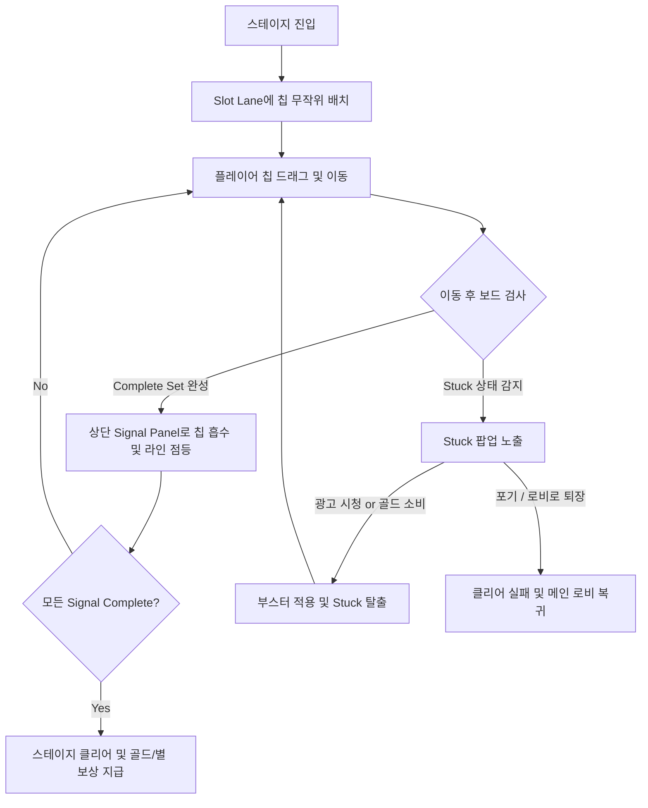

# Signal Sort 시스템 기획서 (Signal Sort System Design)

본 문서는 `project-fill`의 핵심 게임 플레이인 **Signal Sort (시그널 소트)**에 대한 시스템 기획서입니다. 플레이어가 흩어진 컬러 신호 칩을 슬롯 레인에 정렬하여 중앙/상단의 시그널 패널을 복구하는 핵심 규칙 및 조작 상태, 부스터 사양, 교착 상태 구제 로직을 다룹니다.

---

## 1. 개요 및 설계 원칙

- **한 줄 콘셉트**: 흩어진 컬러 신호 칩을 슬롯 레인에 정렬하여 상단의 Signal Panel을 복구하는 미니멀 코드 퍼즐.
- **비주얼 톤앤매너**: 튜브나 물병 같은 전통적인 오브젝트를 배제하고, 세련된 반도체 칩, 카드 슬롯, 회로 기판 등의 전자공학/기판 느낌의 UI 및 1x1 텍스처, 라운드 사각형, 픽셀 텍스트를 위주로 한 코드 기반 미니멀 아트 스타일을 따릅니다.
- **핵심 판타지**: 고장 나거나 꼬인 시스템의 컬러 신호를 정돈해 나가며 상단 패널의 노드와 라인이 하나씩 점등되는 릴랙싱한 기계 복구 감각.

---

## 2. 용어 정의

| 용어 | 정의 |
| :--- | :--- |
| **Signal Chip (칩)** | 유저가 이동시키는 기본 퍼즐 피스. 라운드 사각형 모양이며, 색상과 고유 신호 타입 심볼/패턴이 표기됩니다. |
| **Slot Lane (레인)** | 칩이 수직으로 쌓이는 컨테이너. 물리적인 튜브가 아니라 카드 랙이나 회로 슬롯처럼 표현됩니다. |
| **Capacity (수용량)** | 한 레인이 가질 수 있는 최대 칩 개수. 기본값은 4개입니다. |
| **Top Chip (맨 위 칩)** | 레인의 가장 위에 위치한 칩으로, 현재 조작을 통해 이동할 수 있는 유일한 대상입니다. |
| **Complete Set (세트 완성)** | 한 레인이 동일한 Signal Type의 칩 4개(Capacity)로 완전히 채워진 상태입니다. |
| **Assist (부스터)** | 플레이 중 위기 탈출이나 편의를 돕는 아이템 및 기능. `Add Lane`, `Shuffle`, `Hint`, `Undo` 4종이 존재합니다. |

---

## 3. 기본 규칙 (Gameplay Rules)

- **A-R01 (선택 규칙)**: 유저는 레인의 가장 위에 있는 `Top Chip`만 선택하여 집어 올릴 수 있습니다.
- **A-R02 (이동 규칙)**: 선택한 칩은 **비어 있는 레인** 또는 **맨 위의 칩이 동일한 Signal Type인 레인**으로만 이동할 수 있습니다.
- **A-R03 (수용량 규칙)**: 각 레인의 `Capacity`는 기본 4이며, 이를 초과하여 칩을 배치할 수 없습니다.
- **A-R04 (완성 규칙)**: 한 레인이 동일한 Signal Type 칩 4개로 채워지면 `Complete Set`이 됩니다.
- **A-R05 (완성 연출)**: Complete Set이 된 레인의 칩들은 상단 Signal Panel로 흡수되는 연출이 재생되며, 완성된 레인은 비어 있는 상태가 되어 다시 칩을 수용할 수 있게 됩니다. (MVP 단계의 기본 사양)
- **A-R06 (클리어 조건)**: 스테이지에 존재하는 모든 Signal Type 칩을 Complete Set으로 정렬하여 상단 Panel에 모두 등록하면 스테이지를 클리어합니다.
- **A-R07 (예외 처리)**: 룰에 어긋나는 이동(예: 다른 타입의 칩 위로 이동, 꽉 찬 레인으로 이동)을 시도할 시 이동이 수행되지 않고, 칩의 미세한 흔들림(Shake) 및 경고색 테두리 연출을 통해 실패 피드백을 즉각 제공합니다.

---

## 4. 부스터 시스템 (4 Booster Types)

플레이어는 플레이를 원활하게 진행하기 위해 아래 4종류의 부스터를 사용할 수 있습니다. 부스터는 스테이지 진입 전 혹은 인게임 하단 UI를 통해 보유 수량을 소비하거나 골드를 지불하여 즉석에서 구매/사용할 수 있습니다.

### 1) Add Lane (레인 추가)
- **효과**: 현재 스테이지에 칩이 들어있지 않은 빈 `Slot Lane`을 1개 추가로 생성합니다.
- **제한**: 스테이지당 **최대 1회**만 사용 가능합니다.
- **획득/사용 비용**: 
  - 인게임에서 획득하지 않은 상태라면, 광고 시청(1회 무료 적용) 또는 골드(300골드)를 소비하여 활성화할 수 있습니다.

### 2) Shuffle (셔플)
- **효과**: 레인에 놓인 칩들 중 완료되지 않은 칩들의 위치를 무작위로 섞습니다.
- **제한**: 사용 제한 횟수는 없으나, 사용 시마다 비용이 소모됩니다.
- **사용 비용**: 100 골드

### 3) Hint (힌트)
- **효과**: 현재 보드 상태에서 가능한 유효한 이동 조합(예: A 레인의 Top Chip을 B 레인으로 이동) 중 최적의 1개 액션을 칩과 레인 하이라이트를 통해 가이드합니다.
- **사용 비용**: 50 골드

### 4) Undo (되돌리기)
- **효과**: 플레이어가 직전에 수행한 칩의 이동 액션을 취소하고 이전 상태로 되돌립니다.
- **제한**: 연속으로 이전 이동들을 계속 되돌릴 수 있습니다.
- **사용 비용**: 30 골드

---

## 5. 교착 상태 (Stuck State) 및 구제 흐름

본 게임은 스태미나가 배제되고 이동 횟수(Moves) 제한이 없기 때문에, 스테이지 실패는 주로 **더 이상 어떤 칩도 이동할 수 없는 교착 상태(Stuck)**에 봉착했을 때 발생합니다.

### 5.1. Stuck 자동 감지
- 모든 레인의 `Top Chip`들이 서로 다른 색상의 Top Chip 위에 있거나 수용 한계에 걸려, 어떠한 유효한 이동(비어 있는 레인으로 이동 포함)도 불가능한 상태가 되면 시스템이 실시간으로 이를 감지합니다.
- Stuck이 감지되면 즉시 조작을 중단시키고 **교착 상태(Stuck) 알림 팝업**을 띄웁니다.

### 5.2. Stuck 탈출 및 구제 옵션
팝업창을 통해 플레이어에게 아래 세 가지 선택지가 제공됩니다:

```
┌──────────────────────────────────────────┐
│             교착 상태 발생!              │
│      더 이상 이동할 수 있는 칩이 없습니다.    │
│                                          │
│    [📺 광고 시청: 레인 추가]             │  ← 1회 한정 구제책
│    [🪙 100: 셔플 실행]                    │  ← 재화를 사용한 탈출
│    [↩️ 포기하고 로비로]                    │  ← 실패 기록 및 퇴장
└──────────────────────────────────────────┘
```

1. **광고 보상 (Ad Reward - Add Lane)**
   - 보상형 광고를 1회 시청하면 `Add Lane`이 즉시 적용되어 빈 레인 1개가 추가되고 Stuck 상태가 해제됩니다.
   - 단, 스테이지당 1회로 한정됩니다.
2. **골드 소비 (Gold Purchase - Shuffle/Undo)**
   - 골드를 소모하여 셔플이나 Undo를 즉시 실행해 보드를 풀어나갈 수 있습니다.
3. **포기하기 (Lobby / Restart)**
   - 구제를 거부하고 로비로 돌아가거나 스테이지를 처음부터 재시작할 수 있습니다.
   - 이 경우 스테이지 클리어 실패로 처리되며, 골드나 부스터 보상을 획득할 수 없습니다.

---

## 6. 핵심 게임 플레이 루프



---

## 7. 인게임 UI 및 연출 가이드

- **인게임 배치**:
  - **상단 (HUD)**: 현재 스테이지 번호, 현재 누적 이동 횟수(Moves), 개인 최고 이동 횟수(Best Moves).
  - **중앙 상단**: 완성 진행도를 표현하는 `Signal Panel` (각 Signal Type 세트 완성 시 해당 라인이 점등되는 쉐이더 연출).
  - **중앙**: 퍼즐 조작부인 `Slot Lanes`.
  - **하단 (부스터 바)**: `Undo`, `Hint`, `Shuffle`, `Add Lane` 아이콘 버튼 및 보유 수량(미보유 시 골드 가격 표시).
- **상태별 피드백**:
  - **칩 선택 시**: 칩 스케일이 약간 커지며 테두리에 얇은 펄스 광 효과가 생깁니다.
  - **이동 가능 레인**: Top Chip을 든 상태에서 배치 가능한 다른 레인들이 은은하게 깜빡(Pulse)입니다.
  - **이동 불가 레인 진입**: 칩이 팅기듯이 원래 위치로 돌아가며, 레인 테두리가 빨간색으로 0.2초간 깜빡이고 짧은 좌우 흔들림(Camera/UI Shake)을 줍니다.
  - **Complete Set 완성**: 칩들이 부드럽게 트윈되어 상단 패널의 해당 노드로 모인 뒤 화려한 픽셀 파티클 연출과 함께 전원이 켜지듯 밝게 점등됩니다.
